# Sanātana Dharma Knowledge Tree

<p align="center">


</p>

<p align="center">
A structured, research-oriented knowledge archive for organizing the scriptures, philosophy, traditions, and classical knowledge systems of Sanātana Dharma.
</p>

---

## Overview

This repository is intended to become a clean and interconnected reference system for Sanātana Dharma.

Rather than keeping the material as disconnected notes, the project arranges the tradition into a hierarchy that makes the relationships between texts, schools, and practices easier to understand. The long-term goal is to turn this into a website with visual navigation, readable sections, and expandable content.

The focus is on clarity, structure, and long-term usability.

---

## Repository Links

Repository: `<REPO_URL>`

Clone:

```bash
git clone <REPO_URL>.git
```

---

## What This Project Covers

### Scriptural Foundations
- The four Vedas
- Internal layers of Vedic literature
- The role of the Upaniṣads
- The Prasthānatrayī

### Supporting Disciplines
- Vedāṅgas
- Sanskrit interpretation tools
- Ritual and textual preservation methods

### Applied Traditions
- Upavedas
- Dharmashāstra
- Purāṇas
- Itihāsas

### Philosophical Systems
- Āstika darśanas
- Nāstika darśanas
- Vedānta and its foundations

### Ritual and Worship Traditions
- Āgamas
- Sectarian temple traditions
- Mantra and sādhana frameworks

---

## Knowledge Structure

```text
Sanātana Dharma
├── Vedas
│   ├── Rigveda
│   ├── Yajurveda
│   ├── Samaveda
│   └── Atharvaveda
│
├── Vedic Literature
│   ├── Saṃhitā
│   ├── Brāhmaṇa
│   ├── Āraṇyaka
│   └── Upaniṣad
│
├── Vedāṅgas
│   ├── Śikṣā
│   ├── Vyākaraṇa
│   ├── Chandas
│   ├── Nirukta
│   ├── Jyotiṣa
│   └── Kalpa
│
├── Upavedas
│   ├── Āyurveda
│   ├── Dhanurveda
│   ├── Gāndharvaveda
│   └── Arthaśāstra
│
├── Upāṅgas
│   ├── Dharmashāstra
│   ├── Purāṇas
│   ├── Itihāsas
│   └── Mīmāṃsā and Nyāya
│
├── Darśanas
│   ├── Āstika
│   │   ├── Nyāya
│   │   ├── Vaiśeṣika
│   │   ├── Sāṃkhya
│   │   ├── Yoga
│   │   ├── Pūrva Mīmāṃsā
│   │   └── Vedānta
│   └── Nāstika
│       ├── Bauddha
│       ├── Jaina
│       └── Cārvāka
│
├── Vedānta
│   └── Prasthānatrayī
│       ├── Upaniṣads
│       ├── Bhagavad Gītā
│       └── Brahma Sūtras
│
└── Āgamas
    ├── Śaiva
    ├── Vaiṣṇava
    ├── Śākta
    ├── Gāṇapatya
    ├── Kaumāra
    └── Saura
```

---

## High-Level Mermaid Tree

```mermaid
flowchart TD
    A[Sanātana Dharma] --> B[Vedas]
    A --> C[Vedāṅgas]
    A --> D[Upavedas]
    A --> E[Upāṅgas]
    A --> F[Darśanas]
    A --> G[Vedānta]
    A --> H[Āgamas]

    B --> B1[Rigveda]
    B --> B2[Yajurveda]
    B --> B3[Samaveda]
    B --> B4[Atharvaveda]

    B1 --> B1a[Saṃhitā]
    B1 --> B1b[Brāhmaṇa]
    B1 --> B1c[Āraṇyaka]
    B1 --> B1d[Upaniṣad]

    B2 --> B2a[Saṃhitā]
    B2 --> B2b[Brāhmaṇa]
    B2 --> B2c[Āraṇyaka]
    B2 --> B2d[Upaniṣad]

    B3 --> B3a[Saṃhitā]
    B3 --> B3b[Brāhmaṇa]
    B3 --> B3c[Āraṇyaka]
    B3 --> B3d[Upaniṣad]

    B4 --> B4a[Saṃhitā]
    B4 --> B4b[Brāhmaṇa]
    B4 --> B4c[Āraṇyaka]
    B4 --> B4d[Upaniṣad]

    C --> C1[Śikṣā]
    C --> C2[Vyākaraṇa]
    C --> C3[Chandas]
    C --> C4[Nirukta]
    C --> C5[Jyotiṣa]
    C --> C6[Kalpa]

    D --> D1[Āyurveda]
    D --> D2[Dhanurveda]
    D --> D3[Gāndharvaveda]
    D --> D4[Arthaśāstra]

    E --> E1[Dharmashāstra]
    E --> E2[Purāṇas]
    E --> E3[Itihāsas]
    E --> E4[Mīmāṃsā and Nyāya]

    F --> F1[Āstika]
    F --> F2[Nāstika]

    F1 --> F1a[Nyāya]
    F1 --> F1b[Vaiśeṣika]
    F1 --> F1c[Sāṃkhya]
    F1 --> F1d[Yoga]
    F1 --> F1e[Pūrva Mīmāṃsā]
    F1 --> F1f[Vedānta]

    F2 --> F2a[Bauddha]
    F2 --> F2b[Jaina]
    F2 --> F2c[Cārvāka]

    G --> G1[Prasthānatrayī]
    G1 --> G1a[Upaniṣads]
    G1 --> G1b[Bhagavad Gītā]
    G1 --> G1c[Brahma Sūtras]

    H --> H1[Śaiva]
    H --> H2[Vaiṣṇava]
    H --> H3[Śākta]
    H --> H4[Gāṇapatya]
    H --> H5[Kaumāra]
    H --> H6[Saura]
```



---

## Project Goals

- Preserve the traditional structure of knowledge in a clean digital format.
- Present the material in a way that is easy to navigate on GitHub and in a future website.
- Separate major categories instead of mixing everything into one list.
- Keep the system expandable for future pages and modules.
- Support long-term documentation with consistent naming and cross-links.
- Create a foundation for an interactive `plan.html` page.

---

## Planned Website Features

- homepage overview
- clickable category tree
- scripture pages
- philosophical school pages
- glossary entries
- reference links
- simple navigation between related concepts
- responsive design for desktop and mobile
- clean typography and minimal layout

---

## Proposed File Structure

```text
.
├── README.md
├── tree.md
├── plan.html
├── assets/
│   ├── images/
│   ├── diagrams/
│   └── icons/
├── vedas/
├── vedangas/
├── upavedas/
├── upangas/
├── darshanas/
├── vedanta/
├── agamas/
├── puranas/
├── itihasas/
├── glossary/
└── references/
```

---

## Tags

`#SanatanaDharma` `#Vedas` `#Upanishads` `#Vedanta` `#Darshanas` `#Puranas` `#Agamas` `#Sanskrit` `#KnowledgeTree` `#Documentation`

---

## Status

- Content structure: In progress
- Website blueprint: Planned
- Interactive HTML: Planned
- Visual navigation: Planned

---

## Contribution Focus

Future contributions may include:

- adding source references
- refining category boundaries
- expanding individual scripture pages
- improving the visual tree
- building the HTML prototype
- standardizing glossary entries

---

## License

License information will be added before public release.
