# Sanātana Dharma Knowledge Tree

<p align="center">


</p>

<p align="center">
A structured knowledge archive for organizing the scriptures, philosophy, traditions, and classical systems of Sanātana Dharma into a clean, navigable tree.
</p>

---

## Overview

This repository is designed as a research-oriented foundation for a future website and reference system.

The goal is to present Sanātana Dharma not as a disconnected list of names, but as an interconnected knowledge structure that shows how texts, disciplines, traditions, and philosophical schools relate to one another.

The project focuses on clarity, hierarchy, and long-term expandability. It is intended to support a future interactive `plan.html` page and a wider content platform built around structured navigation.

---

## Repository Links

[Repository Home](https://github.com/<username>/<repository>) · [Clone](https://github.com/<username>/<repository>.git) · [Tree](tree.md) · [Plan](plan.html) · [Glossary](glossary/)

Replace `<username>` and `<repository>` with your GitHub values.

---

## Clone

```bash
git clone https://github.com/<username>/<repository>.git
cd <repository>
```

---

## Tags

`#SanatanaDharma` `#HinduScriptures` `#Vedas` `#Upanishads` `#Vedanta` `#Darshanas` `#Agamas` `#Puranas` `#Sanskrit` `#KnowledgeTree`

---

## Project Purpose

This project exists to:

- preserve classical knowledge in a structured digital format
- make the relationship between scriptures easier to understand
- separate primary sources from explanatory or applied literature
- provide a clean foundation for a future educational website
- support a growing archive of scripture summaries, philosophy notes, and reference material
- create a navigational model that can scale without becoming chaotic

---

## Core Structure

The repository is organized around the traditional layered structure of Indian knowledge systems.

### 1. Vedic Foundation
The four Vedas form the base of the archive. Each Veda can be expanded into its internal textual layers such as Saṃhitā, Brāhmaṇa, Āraṇyaka, and Upaniṣad where applicable.

### 2. Auxiliary Disciplines
The six Vedāṅgas support the study, recitation, interpretation, and ritual preservation of Vedic knowledge.

### 3. Applied Knowledge
The Upavedas and related practical disciplines connect traditional learning with fields such as medicine, music, warfare, governance, and ethics.

### 4. Supplementary Literature
The Upāṅgas include the Purāṇas, Itihāsas, Dharmaśāstras, and interpretive traditions that make the larger culture accessible in practical and narrative form.

### 5. Philosophical Systems
The Darśanas are separated into Āstika and Nāstika schools so the repository can present both classical taxonomy and philosophical diversity.

### 6. Vedānta
Vedānta is treated through the Prasthānatrayī:
- Upaniṣads
- Bhagavad Gītā
- Brahma Sūtras

### 7. Ritual and Temple Traditions
The Āgamas are organized by sectarian and devotional streams, such as Śaiva, Vaiṣṇava, and Śākta traditions.

---

## Knowledge Tree

```mermaid
flowchart TD

A[Sanātana Dharma] --> B[Vedas]
A --> C[Vedāṅgas]
A --> D[Upavedas]
A --> E[Upāṅgas]
A --> F[Darśanas]
A --> G[Vedānta]
A --> H[Āgamas]

B --> B1[Rigveda]
B --> B2[Yajurveda]
B --> B3[Sāmaveda]
B --> B4[Atharvaveda]

B1 --> B1a[Saṃhitā]
B1 --> B1b[Brāhmaṇa]
B1 --> B1c[Āraṇyaka]
B1 --> B1d[Upaniṣad]

B2 --> B2a[Saṃhitā]
B2 --> B2b[Brāhmaṇa]
B2 --> B2c[Āraṇyaka]
B2 --> B2d[Upaniṣad]

B3 --> B3a[Saṃhitā]
B3 --> B3b[Brāhmaṇa]
B3 --> B3c[Āraṇyaka]
B3 --> B3d[Upaniṣad]

B4 --> B4a[Saṃhitā]
B4 --> B4b[Brāhmaṇa]
B4 --> B4c[Āraṇyaka]
B4 --> B4d[Upaniṣad]

C --> C1[Śikṣā]
C --> C2[Vyākaraṇa]
C --> C3[Chandas]
C --> C4[Nirukta]
C --> C5[Kalpa]
C --> C6[Jyotiṣa]

D --> D1[Āyurveda]
D --> D2[Dhanurveda]
D --> D3[Gāndharvaveda]
D --> D4[Arthaśāstra]

E --> E1[Dharmashāstra]
E --> E2[Purāṇas]
E --> E3[Itihāsas]
E --> E4[Mīmāṃsā and Nyāya]

E2 --> P1[18 Mahāpurāṇas]
E2 --> P2[18 Upapurāṇas]

E3 --> R1[Rāmāyaṇa]
E3 --> M1[Mahābhārata]

F --> F1[Āstika]
F --> F2[Nāstika]

F1 --> F1a[Nyāya]
F1 --> F1b[Vaiśeṣika]
F1 --> F1c[Sāṃkhya]
F1 --> F1d[Yoga]
F1 --> F1e[Pūrva Mīmāṃsā]
F1 --> F1f[Uttara Mīmāṃsā]

F2 --> F2a[Bauddha]
F2 --> F2b[Jaina]
F2 --> F2c[Cārvāka]

G --> G1[Prasthānatrayī]
G1 --> G1a[Upaniṣads]
G1 --> G1b[Bhagavad Gītā]
G1 --> G1c[Brahma Sūtras]

H --> H1[Śaiva]
H --> H2[Vaiṣṇava]
H --> H3[Śākta]
H --> H4[Gāṇapatya]
H --> H5[Kaumāra]
H --> H6[Saura]
```



---

## Proposed Repository Structure

```text
.
├── README.md
├── tree.md
├── plan.html
├── glossary/
├── references/
├── assets/
│   ├── diagrams/
│   ├── images/
│   └── icons/
├── vedas/
├── vedangas/
├── upavedas/
├── upangas/
├── darshanas/
├── vedanta/
├── puranas/
├── itihasas/
├── agamas/
└── bibliography/
```

---

## Content Standards

To keep the repository useful over time, the following standards should be followed:

- Use clear, descriptive headings.
- Prefer primary sources where possible.
- Distinguish between scripture, commentary, interpretation, and modern explanation.
- Keep terminology consistent across files.
- Avoid unnecessary duplication.
- Use cross-references when a concept belongs to multiple branches.
- Keep pages concise enough to read, but complete enough to be meaningful.

---

## Planned Website Features

The future website is expected to include:

- a clickable knowledge tree
- scripture and concept pages
- a glossary of Sanskrit terms
- branch-by-branch navigation
- cross-links between related traditions
- a responsive layout for mobile and desktop
- a clean static design suitable for long-term maintenance
- a dedicated `plan.html` page for visual structure and project planning

---

## Roadmap

### Phase 1
- Draft repository structure
- Build the README and tree files
- Organize the primary categories

### Phase 2
- Add scripture pages
- Add glossary entries
- Expand philosophical branches

### Phase 3
- Build `plan.html`
- Add visual navigation
- Connect the tree to page routing

### Phase 4
- Publish a polished static site
- Add search and filtering
- Add references and source notes

---

## Intended Audience

This repository is intended for:

- students of Indian philosophy
- researchers
- readers exploring Hindu scriptures
- developers building educational websites
- anyone who wants a structured overview of the tradition

---

## Status

- Repository concept: defined
- Structure: in progress
- Tree map: drafted
- Website plan: upcoming
- Public release: not yet finalized

---

## License

A license will be added before public release.

Until then, this repository should be treated as an educational work in progress.
